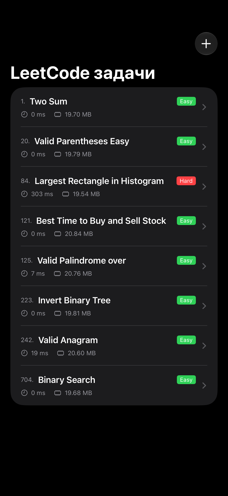
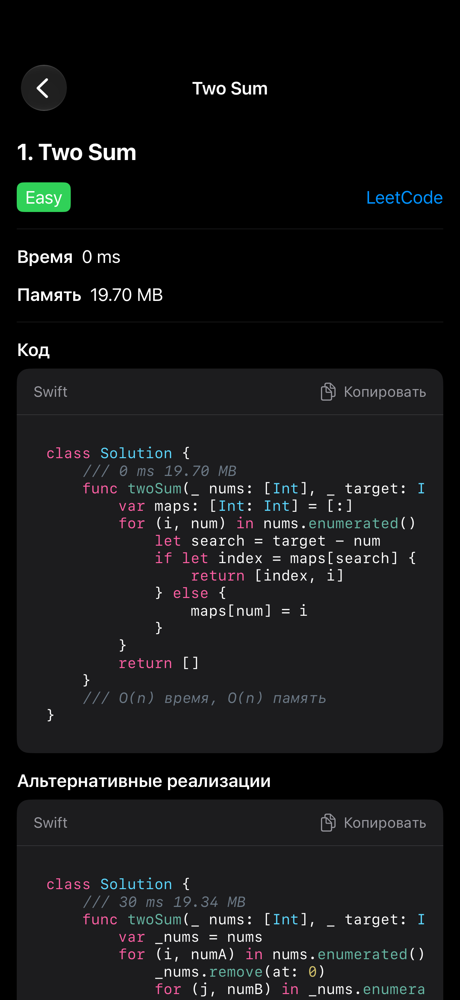
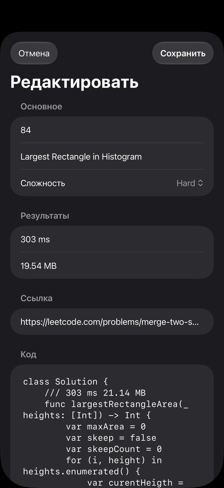
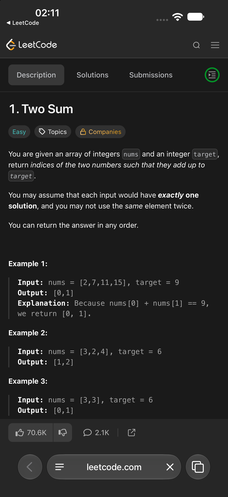

# LeetCode Solutions in Swift
My solutions to LeetCode problems. Here I write down the approach, complexity, results, and conclusions.

<p align="center">
  <picture>
    <source media="(prefers-color-scheme: dark)" srcset="Screens/Screenshot_1_Dark.png">
    <source media="(prefers-color-scheme: light)" srcset="Screens/Screenshot_1_Light.png">
    
  </picture>
  &nbsp;&nbsp;&nbsp;
  <picture>
    <source media="(prefers-color-scheme: dark)" srcset="Screens/Screenshot_2_Dark.png">
    <source media="(prefers-color-scheme: light)" srcset="Screens/Screenshot_2_Light.png">
    
  </picture>
  &nbsp;&nbsp;&nbsp;
  <picture>
    <source media="(prefers-color-scheme: dark)" srcset="Screens/Screenshot_3_Dark.png">
    <source media="(prefers-color-scheme: light)" srcset="Screens/Screenshot_3_Light.png">
    
  </picture>
</p>
<p align="center">
  <picture>
    <source media="(prefers-color-scheme: dark)" srcset="Screens/Screenshot_4_Dark.png">
    <source media="(prefers-color-scheme: light)" srcset="Screens/Screenshot_4_Light.png">
    
  </picture>
  &nbsp;&nbsp;&nbsp;
  <picture>
    <source media="(prefers-color-scheme: dark)" srcset="Screens/Screenshot_5_Dark.png">
    <source media="(prefers-color-scheme: light)" srcset="Screens/Screenshot_5_Light.png">
    
  </picture>
  &nbsp;&nbsp;&nbsp;
  <picture>
    <source media="(prefers-color-scheme: dark)" srcset="Screens/Screenshot_6_Dark.png">
    <source media="(prefers-color-scheme: light)" srcset="Screens/Screenshot_6_Light.png">
    
  </picture>
</p>

---
## 1. Two Sum
| Difficulty | Time | Memory | Link |
|------------|------|--------|------|
| Easy | 0 ms | 19.70 MB | [LeetCode](https://leetcode.com/problems/two-sum/) |
```swift
    class Solution {
        /// 0 ms 19.70 MB
        func twoSum(_ nums: [Int], _ target: Int) -> [Int] {
            var maps: [Int: Int] = [:]
            for (i, num) in nums.enumerated() {
                let search = target - num
                if let index = maps[search] {
                    return [index, i]
                } else {
                    maps[num] = i
                }
            }
            return []
        }
        /// O(n) time, O(n) space
    }
```
###  Alternative implementations
```swift
    class Solution {
        /// 30 ms 19.34 MB
        func twoSum(_ nums: [Int], _ target: Int) -> [Int] {
            var _nums = nums
            for (i, numA) in nums.enumerated() {
                _nums.remove(at: 0)
                for (j, numB) in _nums.enumerated() {
                    if numA + numB == target {
                        return [i,i+j+1]
                    }
                }
            }
            return []
        }
        /// O(n²) time, O(1) space
    }
```

---
## 20. Valid Parentheses
| Difficulty | Time | Memory | Link |
|-----------|-------|--------|--------|
| Easy | 0 ms  | 19.79 MB | [LeetCode](https://leetcode.com/problems/valid-parentheses/)|
```swift
    class Solution {
        /// 0 ms 19.79 MB
        func isValid(_ s: String) -> Bool {
            let map: [Character: Character] = ["(": ")", "{": "}", "[": "]"]
            var current = [Character]()
            for char in s {
                if let searchChar = map[char] {
                    current.append(searchChar)
                } else if char != current.popLast() {
                    return false
                }
            }
            return current.isEmpty
        }
        /// O(n) time, O(n) space
    }
```
###  Alternative implementations
```swift
    class Solution {
        /// 2 ms 20.15 MB
        func isValid(_ s: String) -> Bool {
            let map: [Character: Character] = ["(": ")", "{": "}", "[": "]"]
            var current = ""
            for char in s {
                if let searchChar = map[char] {
                    current.append(searchChar)
                } else if char != current.popLast() {
                    return false
                }
            }
            return current.isEmpty
        }
    }
```

```swift
    class Solution {
        /// 23 ms 20.09 MB
        func isValid(_ s: String) -> Bool {
            let map: [Character: Character] = ["(": ")", "{": "}", "[": "]"]
            var current = ""
            for char in s {
                if let searchChar = map[char] {
                    current.append(searchChar)
                } else {
                    if current.last == char {
                        current = String(current.dropLast())
                    } else {
                        return false
                    }
                }
            }
            return current.isEmpty
        }
    }
```

```swift
    class Solution {
        /// 25 ms 19.99 MB
        func isValid(_ s: String) -> Bool {
            var current = ""
            for char in s {
                switch char {
                    case "(":
                    current.append(")")
                    case "{":
                    current.append("}")
                    case "[":
                    current.append("]")
                    default:
                    if current.last == char {
                        current = String(current.dropLast())
                    } else {
                        return false
                    }
                }
            }
            return current.isEmpty
        }
    }
```

```swift
    class Solution {
        /// 141 ms 20.37 MB
        func isValid(_ s: String) -> Bool {
            let map: [Character: Character] = ["(": ")", "{": "}", "[": "]"]
            var current = [Character]()
            for char in s {
                if let searchChar = map[char] {
                    current.append(searchChar)
                } else {
                    if current.last == char {
                        current = current.dropLast()
                    } else {
                        return false
                    }
                }
            }
            return current.isEmpty
        }
    }
```

---
## 21. Merge Two Sorted Lists
| Difficulty | Time | Memory | Link |
|------------|------|--------|------|
| Easy | 0 ms | 19.70 MB | [LeetCode](https://leetcode.com/problems/merge-two-sorted-lists/) |
```swift
    class Solution {
        /// 0 ms 19.54 MB
        func mergeTwoLists(_ list1: ListNode?, _ list2: ListNode?) -> ListNode? {
            switch (list1?.val, list2?.val) {
            case let (val1, val2) where val1 == nil && val2 != nil:
                return list2
            case let (val1, val2) where val1 != nil && val2 == nil:
                return list1
            case let (val1, val2) where val1 != nil && val2 != nil:
                return val1 ?? 0 < val2 ?? 0 ?
                ListNode(val1 ?? 0, (mergeTwoLists(list1?.next, list2))) :
                ListNode(val2 ?? 0, (mergeTwoLists(list1, list2?.next)))
            default:
                return nil
            }
        }
    }
```

---
##  84. Largest Rectangle in Histogram
| Difficulty | Time | Memory | Link |
|------------|------|--------|------|
| Hard | 303 ms | 21.14 MB | [LeetCode](https://leetcode.com/problems/merge-two-sorted-lists/) |
```swift
    class Solution {
        /// 303 ms 21.14 MB
        func largestRectangleArea(_ heights: [Int]) -> Int {
            var maxArea = 0
            var skeep = false
            var skeepCount = 0
            for (i, height) in heights.enumerated() {
                var curentHeigth = (skeepCount + 1) * height
                var flag = true
                for heightRigth in heights[(i+1)...] {
                    if heightRigth >= height {
                        curentHeigth += height
                        if heightRigth == height, flag {
                            skeep = true
                            skeepCount += 1
                            break
                        }
                        flag = false
                    } else {
                        break
                    }
                }
                if skeep {
                    skeep = false
                    continue
                }
                for heightLeft in heights[..<(i-skeepCount)].reversed() {
                    if heightLeft >= height {
                        curentHeigth += height
                    } else {
                        break
                    }
                }
                skeepCount = 0
                maxArea = max(maxArea, curentHeigth)
            }
            return maxArea
        }
    }
```
###  Alternative implementations
```swift
    class Solution {
        /// over time
        func largestRectangleArea(_ heights: [Int]) -> Int {
            var maxArea = 0
            var map = [Int: Int]()
            for (i, height) in heights.enumerated() {
                map[i] = height
            }
            for i in 0..<heights.count {
                let height = map[i] ?? 0
                var curentHeigth = height
                for left in (0..<i).reversed() {
                    if map[left] ?? 0 >= height {
                        curentHeigth += height
                    } else {
                        break
                    }
                }
                for rigth in (i+1)..<heights.count {
                    if map[rigth] ?? 0 >= height {
                        curentHeigth += height
                    } else {
                        break
                    }
                }
                maxArea = max(maxArea, curentHeigth)
            }
            return maxArea
        }
    }
```

```swift
    class Solution {
        /// over time
        func largestRectangleArea_over2(_ heights: [Int]) -> Int {
            var maxArea = 0
            for (i, height) in heights.enumerated() {
                var curentHeigth = height
                for heightLeft in heights[..<i].reversed() {
                    if heightLeft >= height {
                        curentHeigth += height
                    } else {
                        break
                    }
                }
                for heightRigth in heights[(i+1)...] {
                    if heightRigth >= height {
                        curentHeigth += height
                    } else {
                        break
                    }
                }
                maxArea = max(maxArea, curentHeigth)
            }
            return maxArea
        }
    }
```

---
##   121. Best Time to Buy and Sell Stock
| Difficulty | Time | Memory | Link |
|------------|------|--------|------|
| Easy | 0 ms | 20.84 MB | [LeetCode](https://leetcode.com/problems/merge-two-sorted-lists/) |
```swift
    class Solution {
        /// 0 ms 20.84 MB
        func maxProfit(_ prices: [Int]) -> Int {
            var maxProfit = 0
            var buy = Int.max
            for price in prices {
                buy = min(buy, price)
                maxProfit = max(price-buy, maxProfit)
            }
            return maxProfit
        }
    }
```
###  Alternative implementations
```swift
    class Solution {
        /// 4561 ms 20.68 MB
        func maxProfit(_ prices: [Int]) -> Int {
            var maxProfit = 0
            var current = prices
            for p in prices {
                let buy = current.removeFirst()
                for price in current {
                    if price <= p {
                        break
                    }
                    maxProfit = max(price - buy, maxProfit)
                }
            }
            return maxProfit
        }
    }
```

```swift
    class Solution {
        /// over time
        func maxProfit(_ prices: [Int]) -> Int {
            var maxProfit = 0
            var current = prices
            for _ in prices {
                let buy = current.removeFirst()
                for price in current {
                    maxProfit = max(price - buy, maxProfit)
                }
            }
            return maxProfit
        }
    }
```

---
##  125. Valid Palindrome over
| Difficulty | Time | Memory | Link |
|------------|------|--------|------|
| Easy | 7 ms | 20.76 MB | [LeetCode](https://leetcode.com/problems/valid-palindrome/) |
```swift
    class Solution {
        /// 7 ms 20.76 MB
        func isPalindrome(_ s: String) -> Bool {
            let map: [Character: String] = ["A": "a", "B": "b", "C": "c", "D": "d", "E": "e", "F": "f", "G": "g", "H": "h", "I": "i", "J": "j", "K": "k", "L": "l", "M": "m", "N": "n", "O": "o", "P": "p", "Q": "q", "R": "r", "S": "s", "T": "t", "U": "u", "V": "v", "W": "w", "X": "x", "Y": "y", "Z": "z", "a": "a", "b": "b", "c": "c", "d": "d", "e": "e", "f": "f", "g": "g", "h": "h", "i": "i", "j": "j", "k": "k", "l": "l", "m": "m", "n": "n", "o": "o", "p": "p", "q": "q", "r": "r", "s": "s", "t": "t", "u": "u", "v": "v", "w": "w", "x": "x", "y": "y", "z": "z", "0": "0", "1": "1", "2": "2", "3": "3", "4": "4", "5": "5", "6": "6", "7": "7", "8": "8", "9": "9"]
            let current = s.compactMap { map[$0] }
            let count = current.count / 2
            let left = current.prefix(count)
            let rigth = current.suffix(count).reversed()
            return left.elementsEqual(rigth)
        }
    }
```
###  Alternative implementations
```swift
    class Solution {
        /// 9 ms 21.5 MB
        func isPalindrome_9(_ s: String) -> Bool {
            let current = s.compactMap { $0.isLetter || $0.isNumber ? $0.lowercased() : nil }
            let count = current.count / 2
            let left = current.prefix(count)
            let rigth = current.suffix(count).reversed()
            return left.elementsEqual(rigth)
        }
    }
```

```swift
    class Solution {
        /// 382 ms 20.54 MB
        func isPalindrome_382(_ s: String) -> Bool {
            let map: [Character: String] = ["A": "a", "B": "b", "C": "c", "D": "d", "E": "e", "F": "f", "G": "g", "H": "h", "I": "i", "J": "j", "K": "k", "L": "l", "M": "m", "N": "n", "O": "o", "P": "p", "Q": "q", "R": "r", "S": "s", "T": "t", "U": "u", "V": "v", "W": "w", "X": "x", "Y": "y", "Z": "z", "a": "a", "b": "b", "c": "c", "d": "d", "e": "e", "f": "f", "g": "g", "h": "h", "i": "i", "j": "j", "k": "k", "l": "l", "m": "m", "n": "n", "o": "o", "p": "p", "q": "q", "r": "r", "s": "s", "t": "t", "u": "u", "v": "v", "w": "w", "x": "x", "y": "y", "z": "z", "0": "0", "1": "1", "2": "2", "3": "3", "4": "4", "5": "5", "6": "6", "7": "7", "8": "8", "9": "9"]
            var current = s.compactMap { map[$0] }
            while current.count > 1  {
                if current.removeFirst() != current.popLast() {
                    return false
                }
            }
            return true
        }
    }
```

```swift
    class Solution {
        /// over time
        func isPalindrome_over(_ s: String) -> Bool {
            let map = ["A": "a", "B": "b", "C": "c", "D": "d", "E": "e", "F": "f", "G": "g", "H": "h", "I": "i", "J": "j", "K": "k", "L": "l", "M": "m", "N": "n", "O": "o", "P": "p", "Q": "q", "R": "r", "S": "s", "T": "t", "U": "u", "V": "v", "W": "w", "X": "x", "Y": "y", "Z": "z", "a": "a", "b": "b", "c": "c", "d": "d", "e": "e", "f": "f", "g": "g", "h": "h", "i": "i", "j": "j", "k": "k", "l": "l", "m": "m", "n": "n", "o": "o", "p": "p", "q": "q", "r": "r", "s": "s", "t": "t", "u": "u", "v": "v", "w": "w", "x": "x", "y": "y", "z": "z", "0": "0", "1": "1", "2": "2", "3": "3", "4": "4", "5": "5", "6": "6", "7": "7", "8": "8", "9": "9"]
            var current = s
            while !current.isEmpty  {
                var left = ""
                repeat {
                    if current.isEmpty {
                        return true
                    }
                    left = map[String(current.prefix(1))] ?? ""
                    current = String(current.dropFirst())
                } while left.isEmpty
                var rigth = ""
                repeat {
                    if current.isEmpty {
                        return true
                    }
                    rigth = map[String(current.suffix(1))] ?? ""
                    current = String(current.dropLast())
                } while rigth.isEmpty
                if left != rigth {
                    return false
                }
            }
            return true
        }
    }
```

---
##  226. Invert Binary Tree
| Difficulty | Time | Memory | Link |
|------------|------|--------|------|
| Easy | 0 ms | 19.81 MB | [LeetCode](https://leetcode.com/problems/invert-binary-tree/) |
```swift
    class Solution {
        /// 0 ms 19.81 MB
        func invertTree(_ root: TreeNode?) -> TreeNode? {
            if let val = root?.val {
                return TreeNode(val, invertTree(root?.right), invertTree(root?.left))
            } else {
                return nil
            }
        }
    }
```

---
##  242. Valid Anagram
| Difficulty | Time | Memory | Link |
|------------|------|--------|------|
| Easy | 19 ms | 20.60 MB | [LeetCode](https://leetcode.com/problems/valid-anagram/) |
```swift
    class Solution {
        /// 19 ms 20.60 MB
        func isAnagram(_ s: String, _ t: String) -> Bool {
            guard s.count == t.count else { return false }
            return s.sorted() == t.sorted()
        }
    }
```
###  Alternative implementations
```swift
    class Solution {
        /// 22 ms 20.81 MB
        func isAnagram_22(_ s: String, _ t: String) -> Bool {
            s.sorted() == t.sorted()
        }
    }
```

---
##  704. Binary Search
| Difficulty | Time | Memory | Link |
|------------|------|--------|------|
| Easy | 0 ms | 19.68 MB | [LeetCode](https://leetcode.com/problems/binary-search/) |
```swift
    class Solution {
        /// 0 ms 19.68 MB
        func search(_ nums: [Int], _ target: Int) -> Int {
            for (i, num) in nums.enumerated() {
                if num == target {
                    return i
                }
            }
            return -1
        }
    }
```
